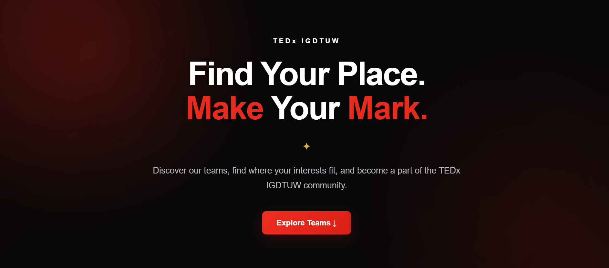
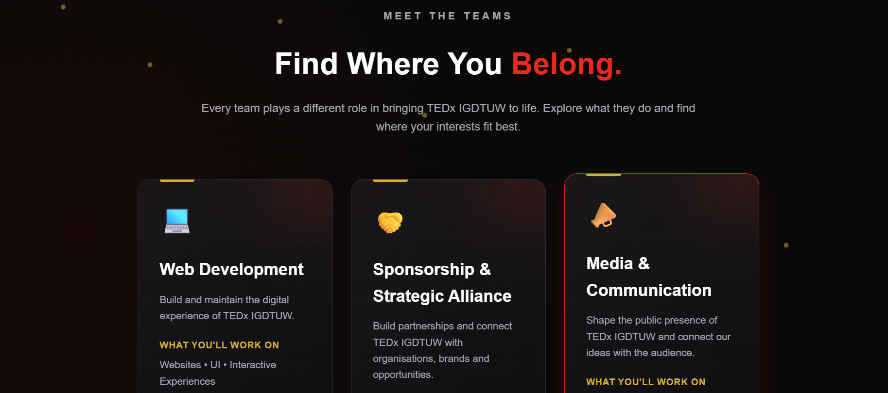
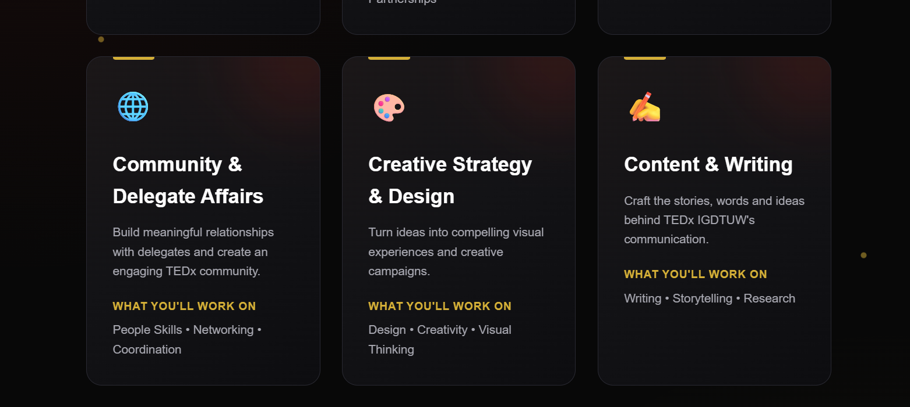
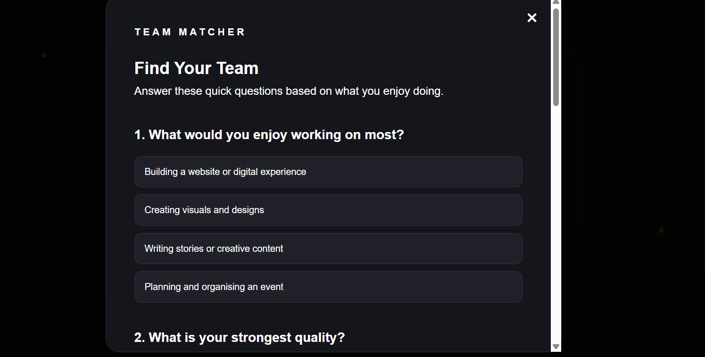
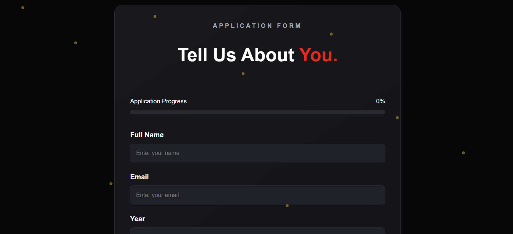
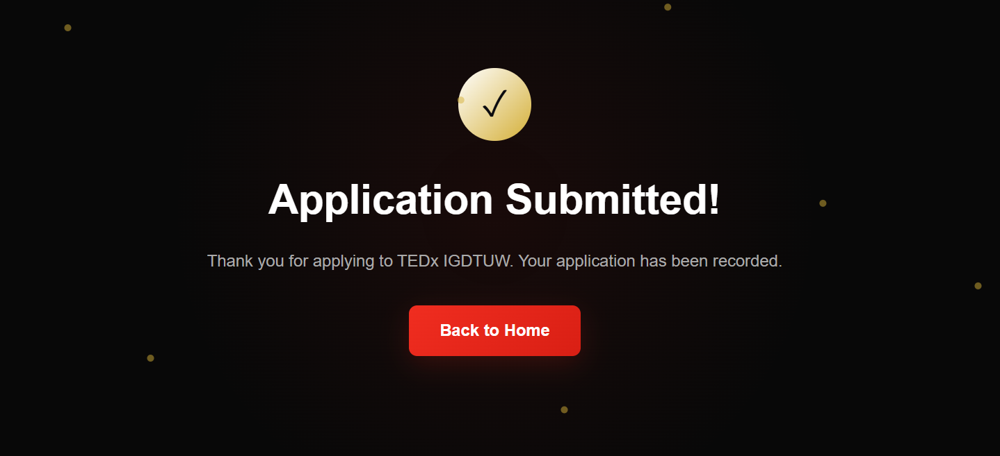

# TEDxIGDTU Recruitment Portal

## What I Built

I built an interactive **TEDxIGDTU Recruitment Portal** that goes beyond a traditional Google Form. A normal Google Form is mostly static, it collects responses but does not really explain **what each team/role does, what kind of work students will be involved in, or what they can expect after joining**. It also does not provide an interactive way to guide students who are unsure about their choice.

My aim was to turn the recruitment process into a **guided experience rather than just a form**. The basic problem I wanted to solve is the **ambiguity students face when trying to understand different roles and deciding where they fit**. The website is intended to give students clarity about each team before they apply, including its responsibilities, the type of work involved, skills that are useful, examples of past events/work, and the **skills and experience they could develop after joining**.

In the current prototype, I have implemented the team showcase, preferences, recruitment form, progress tracking, and an interactive **Team Matcher**. The detailed team information and **application status tracking** are part of my future scope. The application status feature would allow students to know what stage their application is at—for example, **Submitted → Under Review → Shortlisted → Interview Scheduled → Selected/Not Selected**—and notify them when they are shortlisted or an interview is scheduled. Further interview details and communication can then be handled through **WhatsApp**.

If a student is still unsure about which team suits them, they can take the **Team Matcher quiz**. Based on their answers, it recommends a suitable team and explains **why that team may be a good fit**, providing an additional layer of guidance.

### Current Features

Students can currently:

- Explore the different TEDxIGDTU teams and understand their roles.
- Use an interactive **"Find Your Team"** quiz if they are unsure where they fit.
- Receive a team recommendation based on their quiz responses.
- Select up to **two team preferences** without being able to select the same team twice.
- Fill out a structured recruitment application.
- Track application completion using a dynamic **progress bar**.
- Save their application draft in the browser using **Local Storage**.
- Submit their application and receive a confirmation screen.

The teams showcased in the portal are:

- Web Development
- Sponsorship & Strategic Alliance
- Media & Communication
- Community & Delegate Affairs
- Creative Strategy & Design
- Content & Writing
- Events, Brands & People

## Problem & Why This Feature?

I chose this feature based on my **own experience** while considering recruitment. I was personally confused about **which team or role I should apply for** and wanted more clarity about what each team actually does. This made me realize that there are probably many other students who face the same confusion.

A traditional Google Form mainly focuses on collecting responses and does not provide much context or interaction before the application. It does not necessarily tell students **what they are actually signing up for**, what work they will perform, what skills are useful, what previous teams have worked on, or what they could learn and develop after joining.

Instead of simply replacing the Google Form with another form, I wanted to make the recruitment experience more **informative, interactive and guided**.

The portal is designed around the idea:

**Understand the teams first → Find where you fit → Apply with confidence**

The **Find Your Team** matcher provides an additional layer of guidance for students who are still unsure. Based on their interests and answers, it recommends a suitable team and explains **why that team may be a good fit**.

With more time, I would expand the team discovery section to provide detailed information about each team's responsibilities, actual work, required/useful skills, previous events and work, and the **skills and experience students can develop after joining**. I would also add application status tracking so students know what is happening after they submit their application, including shortlisting and interview updates.

## Key Technical & Design Decisions

### HTML, CSS & JavaScript

I used HTML, CSS and JavaScript to keep the prototype lightweight and achievable within the 60–90 minute assessment constraint.

### Interactive Team Matcher

The **Find Your Team** quiz uses a simple scoring system. Each answer is associated with a team, and the team with the highest score is recommended to the student.

This gives students a quick way to discover a team rather than having to decide purely from a list.

### Two Team Preferences

Students can select up to two teams as their preferences. The interface also prevents the same team from being selected as both preferences.

### Local Storage

I used the browser's `localStorage` to save the student's application data.

This allows the student to refresh the page or temporarily leave the website without immediately losing their entered information.

Since this is a prototype, I intentionally chose Local Storage instead of introducing a backend/database within the given time constraint.

### Progress Bar

The application includes a dynamic progress bar that updates as the student completes the form, providing immediate feedback about their progress.

### UI/UX

The interface uses a TEDx-inspired visual style with:

- Dark background
- Red accent colour
- Gold decorative elements
- Clear call-to-action buttons
- Smooth scrolling
- Interactive modal for the team matcher
- Responsive layouts

## AI Tools Used

AI tools were used as a development aid for:

- Understanding HTML, CSS and JavaScript concepts.
- Generating and refining parts of the initial implementation.
- Debugging implementation issues.
- Iterating on the UI and visual design.

I tested and modified the generated code while developing the feature and reviewed the logic used in the final implementation.

## Screenshots

### Landing Page

### Team Showcase

### Team Matcher

### Recruitment Form

### Confirmation

## What I Would Improve With More Time

Due to the 60–90 minute constraint, I focused on building a functional frontend prototype.

With more time, I would add:

- **Detailed Team Discovery:** Expand the team showcase into a more detailed discovery experience where students can learn exactly what each TEDxIGDTU team does, the kind of work and responsibilities involved, skills that are useful for the team, examples of work from previous events, and what a student can expect to learn and develop after joining. This would help students make informed team preferences instead of choosing a team based only on its name.

- **Application Status & Interview Notifications:** Add an applicant dashboard where students can track their application through stages such as **Submitted → Under Review → Shortlisted → Interview Scheduled → Selected/Not Selected**. Students would be notified when their application is shortlisted or when an interview is scheduled, so they are not left wondering about what happens after submitting their application. Further interview details and communication can then be handled through **WhatsApp**.

- **Backend/Database Integration:** Replace Local Storage with a backend and database so applications can be securely stored and accessed centrally by the TEDxIGDTU recruitment team.

- **Admin Dashboard:** Provide the recruitment team with a centralized dashboard to view, filter, shortlist and manage applications.

- **Team-Specific Application Questions:** Introduce questions relevant to the student's selected team preferences to make the application more meaningful and role-specific.

- **Email Confirmation & Notifications:** Send automated confirmations and important recruitment updates to applicants.

- **Authentication:** Add secure authentication for applicants and administrators.

- **Improved Form Validation & Accessibility:** Add stronger input validation and improve accessibility across the portal.

- **More Refined UI Interactions:** Add further animations and micro-interactions while keeping the interface focused on usability.

## Deployment

**Live Demo:**  
https://tedxigdtuwrecruitmentportal-alpha.vercel.app/

## Repository

**GitHub:**  
https://github.com/ishitasanger/TEDxIGDTUW-Recruitment